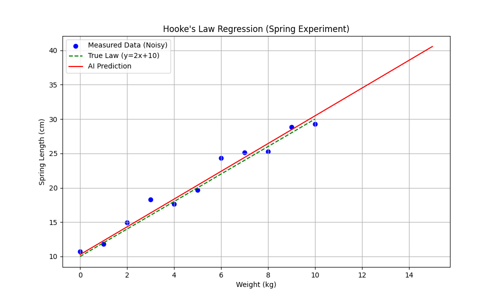
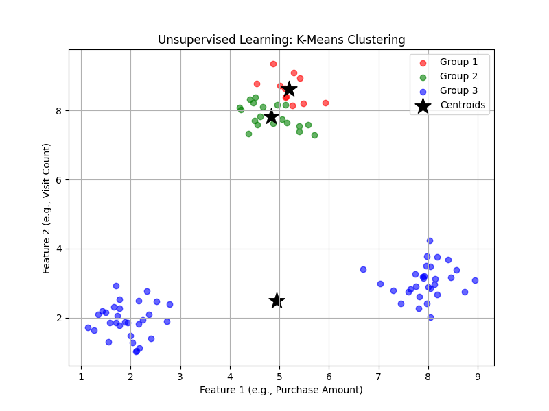
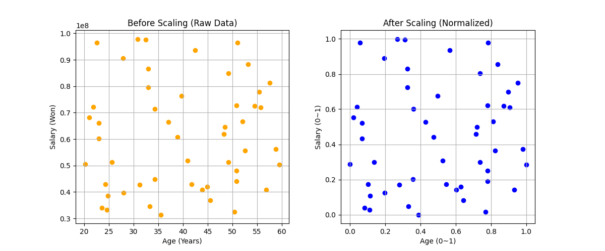
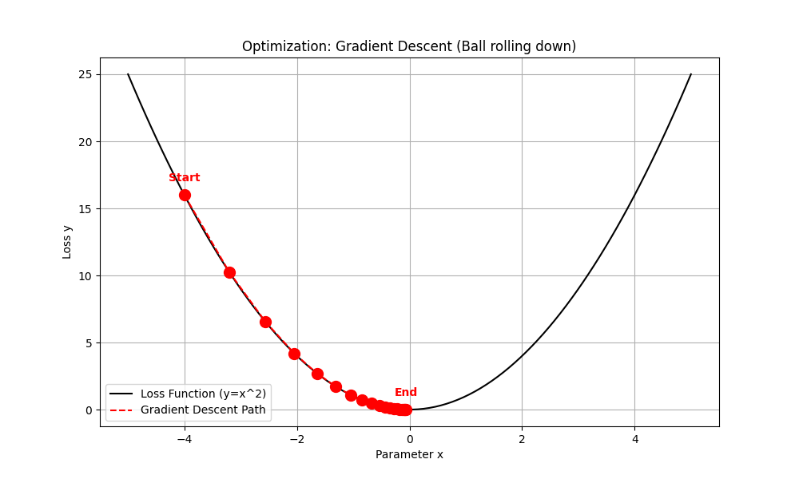
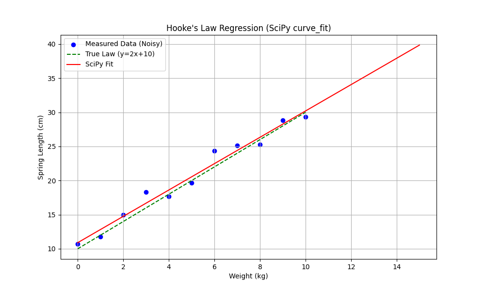
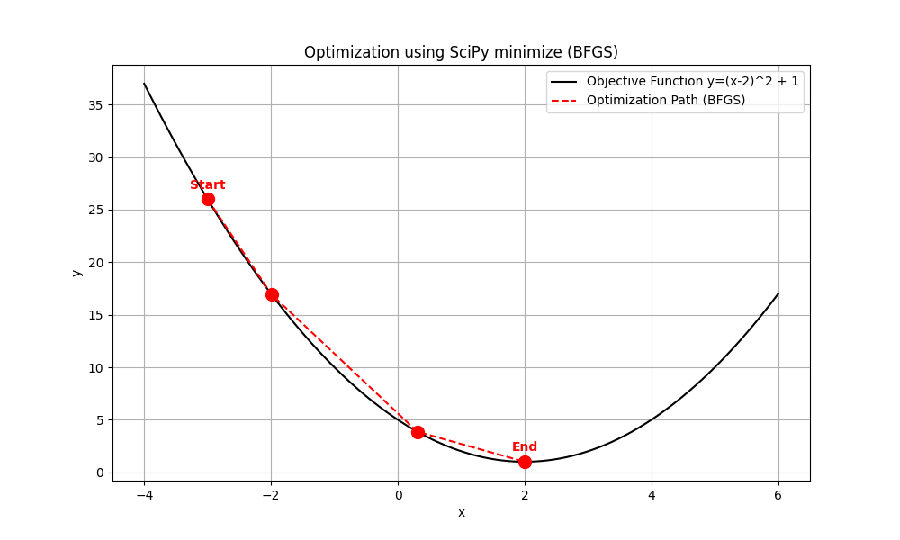

1. linear regression
# Spring Fitting

  

2. unsupervised learning_clustering
# Clustering

  

3. data preprocessing
# Preprocessing

  

4. gradient descent_visualization
# Gradient Descent

  

5. spring_SciPy
# Spring Scipy Example

  

6. optimization -SciPy
# Optimization Scipy Example

  

  
# 유튜브 강의  
**AI 영상 요약**
 이 영상은 **딥러닝을 이용한 시퀀스 모델링(Sequence Modeling)**의 기초를 다루며, **순환 신경망(RNN)**과 트랜스포머(Transformer) 구조에 대해 설명합니다. (0:09) 시퀀스 데이터(음성, 텍스트, 주식 등)의 중요성을 강조하며, 이를 처리하기 위한 신경망 모델의 발전 과정을 보여줍니다.

주요 내용 요약
순환 신경망 (RNN): (11:14) 이전 단계의 상태를 다음 단계로 전달하는 **내부 메모리(Hidden State)**를 통해 시퀀스 데이터를 처리합니다. 텍스트 생성이나 음악 작곡과 같은 다대다(Many-to-Many) 문제를 해결하는 데 필수적입니다. (39:23) 하지만, 긴 시퀀스에서 정보를 기억하지 못하는 기울기 소실/폭발 문제가 발생할 수 있습니다.
어텐션 메커니즘 (Attention): (46:08) RNN의 한계를 극복하기 위해 제안된 기술로, 시퀀스 내에서 **가장 중요한 부분에 집중(Attend)**하여 정보를 추출합니다. 마치 검색 엔진처럼 **쿼리(Query), 키(Key), 값(Value)**을 사용하여 데이터 간의 연관성을 계산합니다. (56:20)
트랜스포머 (Transformer): (46:33) 어텐션 메커니즘을 기반으로 한 현재 최신 시퀀스 모델입니다. 시퀀스를 한 번에 처리하여 병렬 계산이 가능하고 장기 의존성 문제를 해결했습니다.  

  

  

**리뷰**
 이번 강의에서는 Rnn과 attention, 그리고 attention을 활용한 Transformer에 대해 설명하는 것으로 위의 AI의 요약과 같다. 다만 RNN 파트에 나온 개념인 hidden state(h)의 번역을 내부 메모리라고 번역해 두었는데, hidden state의 공식적 번역은 없으나 적어도 내부 메모리는 h의 역할에는 어울리지 않는 번역이다. hidden state는 하나의 feedforward neural network(FFN)가 끝나고 다음 FFN으로 넘어갔을 때, 이번 시퀀스에서 일어난 결과를 다음 시퀀스에 반영하기 위해 각각의 FNN 사이를 이어주는 역할을 하는 것으로 당연하게도 이는 시간의 흐름 또한 나타낸다. 따라서 hidden state를 올바르게 번역하자면 그냥 직역 상태인 **'숨겨진 상태'** 가 더 옳을 것이다. 각 FFN을 h가 이어주어 큰 하나의 과정이 만들어지는데 이렇게 한 h가 도입되어 FFN 구조가 반복되어 학습하는 구조를 **Recurrent Neural Network(RNN)'** 이라고 한다. 다만, 이런 RNN의 단점은 인코딩 병목, 느리고 병행 불가, 기억이 오래 유지되지 않는다는 단점이 있어 도입된 메커니즘이 **Attention**이다. Attention은 RNN의 순환을 없애고 그냥 하나의 연산을 위한 행렬로 압축한 메커니즘을 말한다. RNN과는 달리 Query(Q), Key(K)를 통해 유사성을 계산한 뒤, 각 요소에 value를 부여해 결과를 도출하는 것으로 RNN의 단점을 극복한다. 이 때 유사성은 Q와 K의 내적을 통해 연산된다. Transformer란 이런 Attention 메커니즘을 기반으로 한 모델로 chat GPT의 T가 Transformer의 T다. AI요약에서 이해가 약간 안되는 마지막 부분을 좀 더 자세히 설명한 것이다. 이런 Tranformer를 적용한 것으로 **Language processing, Biological sequences, Computer vision**이 있다.

